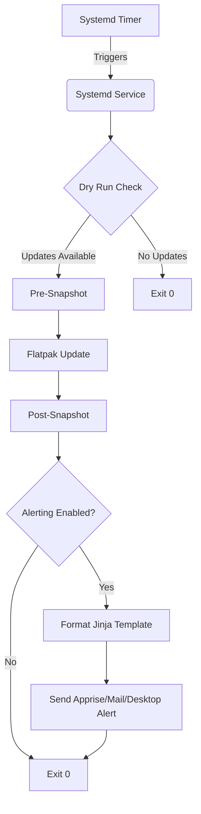

<!-- prettier-ignore-start -->
<!-- markdownlint-disable-next-line MD033 MD041-->

<!-- prettier-ignore-end -->

# Technical Manifest

**Flatpak Automatic** is a secure, systemd-native automation wrapper for Flatpak
updates. It features Snapper-integrated atomic rollbacks, multi-channel alerting
(Apprise, Mail, Webhooks, Desktop), and supports both system-wide and rootless
user-level execution. Designed for reliability and ease of use, it ensures your
Flatpak environment remains current and resilient.

## 🏗 Architectural Overview

The project is structured as a single RPM/DEB package providing the following
components:

### 1. Automation Core (`src/flatpak-automatic.py`)

- **Update Logic**: Handles the `flatpak update` process with dry-run checks via
  D-Bus and CLI to avoid unnecessary operations.
- **Snapshot Integration**: Automatically creates Snapper pre/post snapshots if
  Btrfs and Snapper are detected.
- **Notification System**: Multi-channel support. Uses Jinja2 templates
  (`config/templates/`) to format outputs for Apprise, Webhooks, Desktop
  notifications, and local mail (`s-nail`/`mailx`).

### 2. Systemd Integration (`config/systemd/`)

- **Timer**: Manages the daily execution schedule with randomized delays to
  prevent server congestion (`flatpak-automatic.timer` /
  `flatpak-automatic-user.timer`).
- **Service**: A `oneshot` service that executes the automation script with
  proper environment configuration.

### 3. Configuration (`config/`)

- **Sysconfig (`config/sysconfig/flatpak-automatic`)**: Holds environment-based
  configuration for snapshot behavior and Snapper settings.
- **YAML Configs**: Stores structured settings (e.g., `config.default.yaml`,
  `config.user.default.yaml`, `config.example.yaml`).
- **Python Packaging (`pyproject.toml`)**: Defines the project metadata,
  dependencies, and entry points following PEP 621.

## 🛠 Project Standards

- **Exclusion Management**: Supports surgical updates by allowing users to
  exclude specific Flatpak App IDs via the `exclusions` configuration key.
- **Dual-Default Configuration**: Employs a context-aware loading strategy that
  switches between system (`config.default.yaml`) and user
  (`config.user.default.yaml`) default profiles based on process UID.
- **XDG Scaffolding**: Automatically initializes a user's local configuration at
  `~/.config/flatpak-automatic/config.yaml` using the user default profile
  (`config.user.default.yaml`) upon first rootless execution.
- **Idempotency**: The update script handles "No updates available" gracefully
  by cleaning up its own pre-update snapshots.
- **Atomic Operations**: Every update attempt is preceded by a Snapper `pre`
  snapshot and followed by a `post` snapshot only if changes occurred.
- **Configuration Persistence**: The `/etc/sysconfig/flatpak-automatic` file is
  marked as `noreplace` to preserve user overrides during package updates.
- **Automated RPM Spec**: The RPM changelog is generated from `CHANGELOG.md`
  using `scripts/build/update-package-metadata.py` and injected directly into
  the `%changelog` section of the `.spec` file.
- **Markdown Linting**: All changes to Markdown files (`.md`) must adhere to the
  project's Markdown linting rules (enforced via `.markdownlint.jsonc`),
  especially MD013 to prevent line length overflows.
- **Language Standard**: Always use English when editing any project files,
  including code, comments, and documentation.

## 🚀 Deployment Workflow

To deploy changes locally for testing:

1. **Build the RPM:** `make rpm` (For Debian, utilize
   `scripts/build/build-deb-local.sh`).
2. **Generate Repo:** `make rpm-repo CHANNEL=testing`
3. **Update Local Repo:** `cp -r repo/ ../dnf-repos/flatpak-automatic/`
4. **Install/Reinstall:**
   `sudo dnf reinstall -Cy ../dnf-repos/flatpak-automatic/latest/testing/*.rpm`
5. **Manage Timer:** `sudo flatpak-automatic --enable-timer` (or
   `--disable-timer`)

## 🤖 AI & CLI Guidelines

- **Self-Correction:** After modifying this `AGENT.md` (or `AGENTS.md`),
  immediately re-read it to ensure the active context reflects the latest
  project guidelines.

- **Professionalism:** Maintain high engineering standards. Write clean,
  idiomatic Python 3 (PEP 8 with type hints), communicate clearly, and verify
  all changes before completion.

- **Branching Strategy (Mandatory):** All features, bug fixes, and other changes
  must be developed in a new branch. Never commit directly to `main`. Branch
  protection rules MUST be configured on `main` to require status checks and
  mandatory Pull Requests.

  Branch names must follow: `<type>/v<version>-<short-description>` _Where
  `<type>`:_ `feat` | `fix` | `chore` | `refactor` | `docs` | `ci` | `style` |
  `test` | `revert` | `perf` | `build` | `format` | `deps` | `sec` _Where
  `<version>`:_ target release version

- **Conventional Commits (Mandatory):** Because `CHANGELOG.md` is automatically
  generated from commit history, you **MUST** use Conventional Commits (e.g.,
  `feat: Add webhook support`, `fix: Resolve DBus timeout`). Commit messages
  must be professional, descriptive, and "customer-ready."

- **Pull Request Workflow:**
  - Standard feature/fix PRs MUST be created using the GitOps PR CLI tool
    provided in this repository (`scripts/maintainer/gitops-pr-cli-tool.sh`).
  - These standard PRs target existing versions and do not bump version numbers.

- **CI & Quality Requirements:** All Pull Requests must pass CI checks before
  merging. This includes:
  - `pre-commit` hooks
  - `markdownlint` & `rpmlint`
  - `shellcheck` & `shfmt`
  - `lint-python` (Ruff, Mypy, Bandit for security)
  - Pytest suite (`tests/`)
  - RPM/DEB build and smoke tests

- **Testing (`tests/`):** Thoroughly test all changes before committing:
  - Write or update unit/integration tests in the `tests/` directory (e.g.,
    `test_notifications.py`, `integration_test_dbus.py`).
  - Run `pytest` locally.
  - Verify systemd integration and timer scheduling.

- **Verification:** After modifying the RPM spec
  (`rpm/flatpak-automatic.spec.in`), Debian controls (`debian/`), or `Makefile`:
  - Verify file paths and installation logic.
  - Ensure resulting packages behave as expected.

- **Documentation:** Keep documentation consistent and up to date:
  - Update `docs/development.md` for build steps.
  - Update `README.md` and man pages (`docs/flatpak-automatic.1`) for
    user-facing changes.

- **Versioning & Release Process (`tbump`):** Do **NOT** manually edit
  `CHANGELOG.md` during feature development.
  1. For a new release, you MUST use tbump in no-push mode:
     `tbump <version> --no-push --non-interactive`.
  2. `tbump` will automatically trigger the hook to sync/generate the
     `CHANGELOG.md` based on commit history, bump the version in `Makefile` and
     metadata files, and bundle it into a single commit.
  3. This commit is then pushed manually to open the **final "Release PR"**.
     Once merged, the version tag is manually pushed to trigger the CI release.

- **Script Requirements:** All scripts (`scripts/maintainer/`, `scripts/build/`)
  must be idempotent, failure-tolerant (using `set -euo pipefail` for bash), and
  safe to re-run.

## 📦 Reference Docs

- [README.md](README.md): Installation and usage guide.
- [CONTRIBUTING.md](.github/CONTRIBUTING.md): Guidelines for contributors.
- [DEVELOPMENT.md](docs/development.md): Build instructions and technical notes.
- [CHANGELOG.md](CHANGELOG.md): Record of notable changes and versions
  (Auto-generated on release).
- [MAINTAINERS.md](MAINTAINERS.md): Project maintenance guide.
- [LICENSE](LICENSE): GPL-3.0-or-later.

**Note:** All changes made to this instruction file must also be reflected in
`AGENTS.md` and `GEMINI.md`.

## Architecture & Execution Flow

